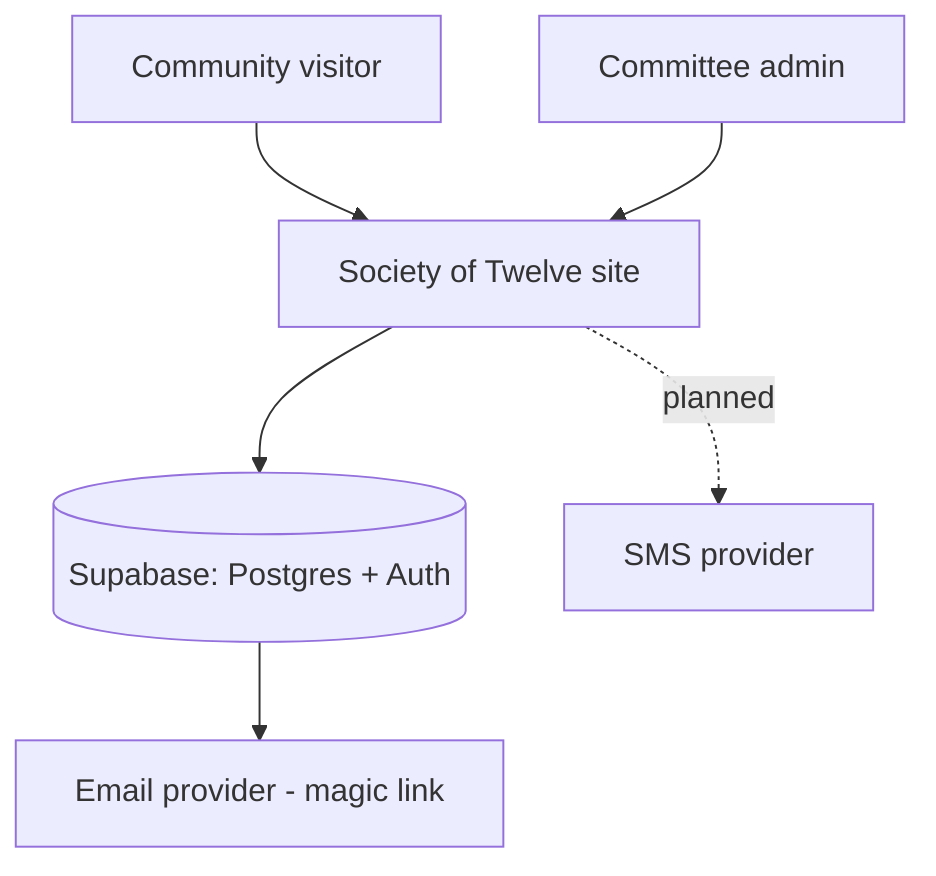

# L1 — System context

Who uses the system and what it talks to.

- **Visitor**: reads the public Bengali homepage.
- **Admin**: manages members, payments, finance, notices, projects, mahfil.
- **Supabase**: authentication (magic link) + data.
- **SMS provider**: planned, not yet contracted.
