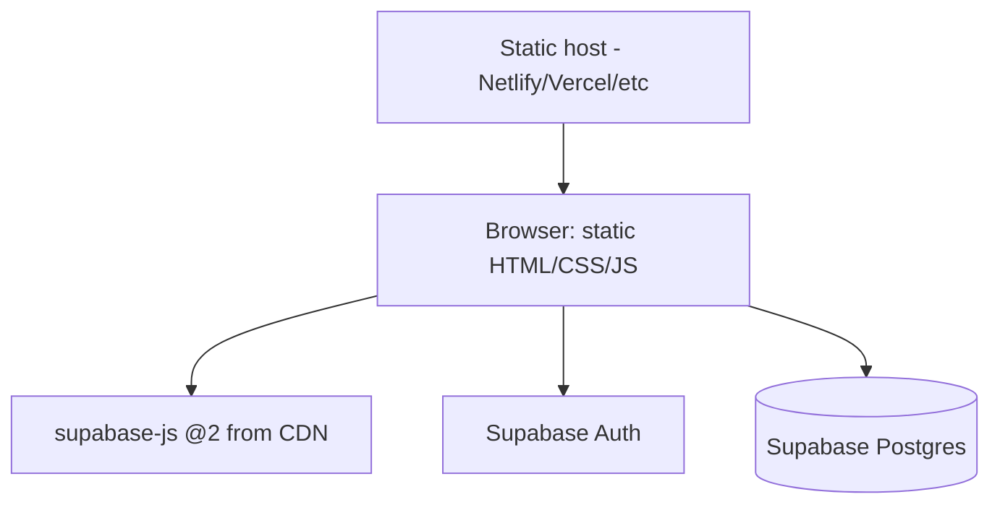

# L2 — Containers

Deployable/runnable units.

- **Static host**: serves `index.html`, `admin/*`, `assets/*` (no server tier of our own, no build step).
- **Browser**: runs all app logic; talks directly to Supabase using `window.SOT_CONFIG` (anon key).
- **Supabase**: Auth + Postgres (schema in `supabase/schema.sql`). RLS not yet enabled (known gap).
