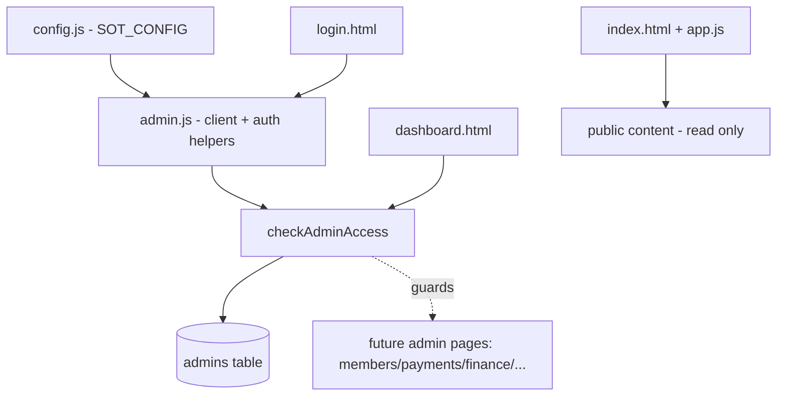

# L3 — Components (browser container)

- `admin.js` is the shared spine: creates the Supabase client and exposes `checkAdminAccess()` / `logoutAdmin()`.
- Every admin page loads `config.js` → `admin.js` → its own script, and guards with `checkAdminAccess()`.
- The public page (`index.html` + `app.js`) is a leaf; today it only sets the footer year.
