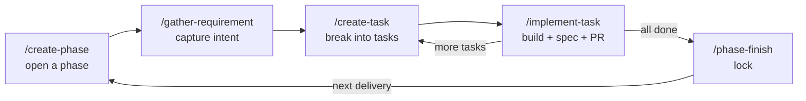

# Developer workflow

How you actually build with this system, start to finish. Read this once; it's the process every
feature goes through. If you only remember one thing: **you never write the spec by hand — five
commands do, and each has one job.**

---

## The mental model (why the process exists)

Traditional dev: code is the source of truth, and everyone (humans and agents) reads the code to
understand the system. That's slow and it hallucinates.

Here, the flow is inverted and split into two clean halves:

1. **Intent** — *what the client wants*, in plain business language, is **gathered** into a phase's
   `requirement/` folder. Editable, client-facing, no tech.
2. **Reality** — *what was actually built* is **derived** into the `05-features/` spec (business +
   technical + test context) — but only by the command that writes the code. Never hand-edited.

The link between the two is the **acceptance criterion (AC)**. An AC is gathered as intent, turned
into a task, built with a test, and settled into the spec — keeping the same id the whole way. That
single stable id (`AC3` means the same thing in the requirement, the task, and the spec) is what the
parity hook checks every turn.

**Three rules hold the whole thing together:**
- **Command-only.** Requirements and the spec change *only* through the five commands.
- **One active phase.** Exactly one phase is open at a time; finish (lock) it before the next.
- **Map first.** Every task starts by reading `architecture-map.md` and loading only what it names.

---

## The five commands, in order

| # | Command | Job | Writes to |
|---|---------|-----|-----------|
| 1 | `/create-phase <id> "<title>"` | Open a phase (the unit of delivery) | `06-phase/<id>/` |
| 2 | `/gather-requirement "<what the client wants>"` | Capture intent, pure business, per feature | `06-phase/<id>/requirement/` |
| 3 | `/create-task "<id>" "<what to do>"` | Break a requirement into a buildable ticket | `06-phase/<id>/task-*.md` |
| 4 | `/implement-task "<id>" "<task-id>"` | Build it (test-first) + settle the spec + open PR | code, `05-features/`, PR |
| 5 | `/phase-finish <id>` | Verify green, lock the phase as permanent history | `06-phase/<id>/` |



---

## Step by step — what / why / how

### 1. Open a phase — `/create-phase`

- **What:** creates `06-phase/<id>/` and makes it the single active phase.
- **Why:** a phase is one coherent delivery ("Phase 2: Checkout"). Scoping work into one active
  phase is what stops half-finished threads piling up — you can't start the next until this one
  locks.
- **How:** `/create-phase phase-2 "Checkout"`. It refuses if another phase is still active (finish
  that one first). It also seeds the phase's `requirement/` folder.
- **Gotcha:** ideas that don't belong in the active phase go in `06-phase/BACKLOG.md`, not a new
  phase.

### 2. Gather requirements — `/gather-requirement`

- **What:** captures what the client wants, **feature by feature**, into
  `06-phase/<phase>/requirement/<feature>/requirement.md` — Goal, user stories, business rules, and
  acceptance criteria (`### AC1…`, Given/When/Then).
- **Why:** intent and implementation are different things. Keeping the client's ask separate and in
  plain language means a non-technical stakeholder can read and approve it, and the build can't
  quietly redefine scope.
- **How:** `/gather-requirement "Users can pay with a saved card"`. It splits the ask across the
  features it touches and writes one requirement per feature. Shared work that isn't one feature
  (auth, logging, migrations) goes under the reserved feature `_cross-cutting`.
- **The AC id rule:** ids are **permanent and unique per feature**. If a feature already has ACs
  (from an earlier phase or its built spec), continue numbering — never restart at `AC1`, never
  reuse an id, never reword an already-built AC in place (supersede it with a new id instead).
- **Gotcha:** no tech here. If you're naming a class or a file, you're in the wrong command.

### 3. Break into tasks — `/create-task`

- **What:** turns a gathered requirement into a Jira-style ticket under the phase, bound to the
  exact AC ids it will deliver.
- **Why:** a requirement may be big; a task is a shippable slice with a clear "done." Tasks are also
  where sequencing lives.
- **How:** `/create-task "phase-2" "Add saved-card selection to checkout"`. It reads the feature's
  `requirement.md`, pulls the AC ids, and writes the ticket. It refuses if the ACs aren't gathered
  yet — run `/gather-requirement` first.
- **Coverage:** every gathered AC should end up in some task. The parity hook prints an **advisory**
  for any requirement AC with no task yet (this is normal right after gathering — it's not an
  error, just a reminder before you lock the phase).

### 4. Implement — `/implement-task`

- **What:** the **only** command that writes code, and the **only** one that writes the
  `05-features/` spec.
- **Why:** code and spec must land together, by the same actor, so they can't drift. The spec is the
  as-built record — it's meaningless if written before or after the code by someone else.
- **How:** `/implement-task "phase-2" "T03"`. It:
  1. Loads Tier A (rules + anti-patterns) + the requirement + the feature's spec (if it exists).
  2. Branches off `main`.
  3. Builds **AC by AC, test first** — write the failing test, minimal code to pass, commit one AC
     per commit.
  4. Settles the spec: authors `business-context.md` from the requirement (copying AC ids/text
     **verbatim**), fills `technical-context.md` + `test-context.md`, updates `INDEX.yml`. First
     time it touches a feature, it creates the `05-features/<feature>/` folder.
  5. Opens a PR.
- **Contracts:** if a feature's public surface changes, this is where `contract_version` is bumped
  and every consumer's `depends_on` pin is updated. The parity hook blocks on a stale pin.
- **Gotcha:** it will **not** invent business scope. If the client wants something the requirement
  doesn't cover, stop and run `/gather-requirement` — don't stretch the AC.

### 5. Lock the phase — `/phase-finish`

- **What:** seals the phase as permanent, read-only history and clears the active-phase pointer so
  the next phase can start.
- **Why:** locking makes the completed work immutable — a trustworthy record you never re-litigate.
- **How:** `/phase-finish phase-2`. Before it locks it **proves green**:
  - **Hard stop, no override:** failing tests, or parity/contract corruption. A phase that lies is
    never sealed.
  - **Abandonable via `LOCK`:** unfinished-but-passing tasks and coverage advisories (gathered ACs
    you chose not to build) — you can seal anyway with explicit confirmation, and they do *not*
    carry forward.
- **Gotcha:** there is no unlock. Locked is forever.

---

## What the hooks do for you (so you don't have to)

Installed hooks run automatically — you never call them:

- **`git-guard.sh`** (before every git command) — blocks `--no-verify`, `git add -A/.`, commits or
  pushes to `main`/`develop`, and force-push. It's a pure gate.
- **`context-autosync.py`** (after every turn) — syncs mechanical fields: `ac_count` in `INDEX.yml`
  from the `### AC` headings, and `last_review` dates. Never touches prose or frozen files.
- **`check-spec-cache.sh` + `spec-parity.py`** (after every turn) — the safety net. Blocks on
  **corruption** (requirement↔spec drift, AC-id collision, stale contract pin) and prints
  **advisories** for coverage gaps. If it complains, it names the command that fixes it.

Git is never automatic: **no auto-commit, no auto-PR, no auto-merge.** You always see the diff and
approve. Approval is per-action — okaying a commit is not okaying a push.

---

## Common scenarios

| You want to… | Do this |
|---|---|
| Build a brand-new feature | `/gather-requirement` (new feature appears in `requirement/`) → `/create-task` → `/implement-task`. The feature's `05-features/` folder is created during implement. |
| Change an existing feature | `/gather-requirement` (adds/supersedes ACs — new ids, never edit built ones) → `/create-task` → `/implement-task`. |
| Do cross-cutting work (auth, logging) | Gather it under `_cross-cutting`, then task + implement like anything else. |
| Fix a bug | If it needs a scope change, `/gather-requirement` first; otherwise `/create-task` a fix bound to the existing AC → `/implement-task`. A bug is not a special command. |
| Change a feature's public API | It happens inside `/implement-task` — bump `contract_version`, update consumers' pins. |
| Park an out-of-scope idea | Add a row to `06-phase/BACKLOG.md`. Don't open a second phase. |

---

## A worked pass (the shape of one delivery)

```text
/create-phase phase-1 "Notes"
/gather-requirement "Users can write and delete short notes"
      → 06-phase/phase-1/requirement/notes/requirement.md   (AC1 create, AC2 reject empty)
/create-task "phase-1" "Note create + validation"
      → task-T01 delivers AC1, AC2
/implement-task "phase-1" "T01"
      → tests first, code, PR; creates 05-features/notes/ with AC1/AC2 settled
/phase-finish phase-1
      → tests green + parity clean → phase locked
```

---

## If you're stuck

- **"Which files do I read?"** — `architecture-map.md`. Always. It's the loading policy; load only
  what it names. Never grep the source to orient yourself.
- **"Can I just edit the spec quickly?"** — No. Find the command in the table above. Hand-edits are
  what the whole system exists to prevent.
- **"The Stop hook is complaining."** — Read what it says; it points at the fixing command.
  Advisories (coverage) are fine mid-flow; corruption must be fixed before you move on.
